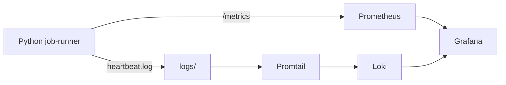
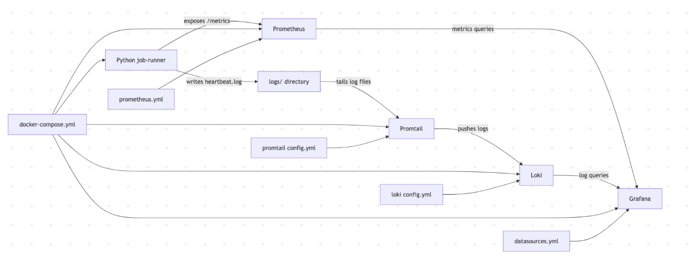
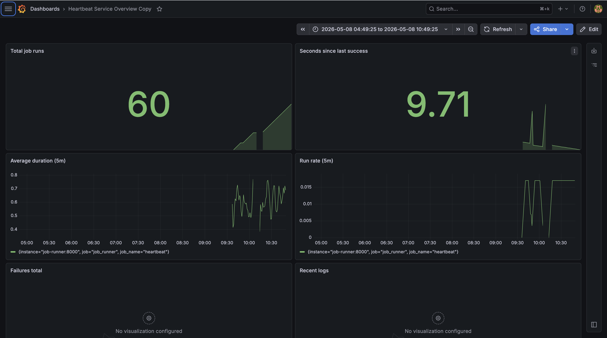
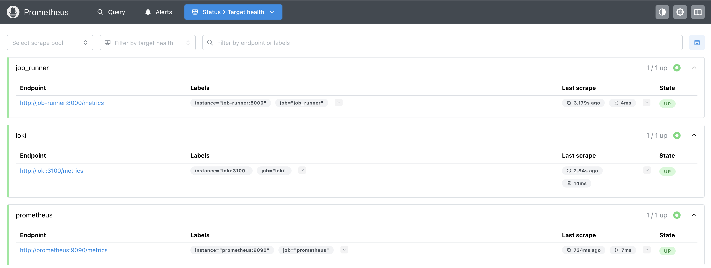
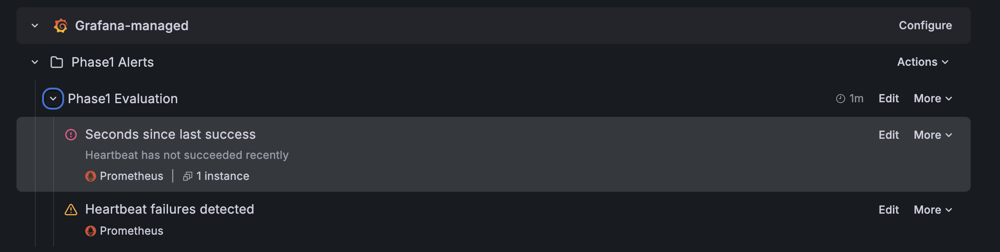

# CloudOps Observability Stack

A local observability project built with Docker Compose, Prometheus, Loki, Promtail, Grafana, and a Python scheduled heartbeat job.

## Overview

This project demonstrates how to build a local observability stack for monitoring scheduled workloads and service-style applications.  
It collects metrics with Prometheus, ships logs with Promtail, stores logs in Loki, and visualizes everything in Grafana.

The project is organized in phases:
- **Phase 1.1** — base observability stack
- **Phase 1.2** — dashboarding, Prometheus exploration, and alerting
- **Phase 1.3** — planned GitHub Actions automation
- **Phase 2** — planned backend services to evolve the project into a microservices-monitored system

## Features

- Docker Compose based local observability stack
- Python heartbeat job with Prometheus metrics
- Prometheus scraping for service metrics
- Loki + Promtail log pipeline
- Grafana dashboard with 6 panels
- Basic Grafana alerting
- Architecture and documentation notes

## Architecture

This stack has two main pipelines:
- **Metrics flow:** `job-runner -> Prometheus -> Grafana`
- **Logs flow:** `job-runner -> log file -> Promtail -> Loki -> Grafana`



### Architecture diagram image

This image shows the same architecture visually as a reference for the documentation.



## Project structure

```text
app/
docker/
docs/
docker-compose.yml
README.md
```

A more complete structure looks like this:

```text
cloudops/
├── app/
│   ├── jobs/
│   ├── Dockerfile
│   ├── entrypoint.sh
│   └── requirements.txt
├── docker/
│   ├── grafana/
│   ├── loki/
│   ├── prometheus/
│   └── promtail/
├── docs/
│   ├── images/
│   └── phase1-heartbeat-dashboard.json
├── logs/
├── docker-compose.yml
└── README.md
```

## Stack

- Python
- Docker Compose
- Prometheus
- Loki
- Promtail
- Grafana

## How it works

### Metrics flow
The Python `job-runner` exposes a `/metrics` endpoint using Prometheus instrumentation.  
Prometheus scrapes that endpoint and Grafana queries Prometheus to visualize the data.

### Logs flow
The Python `job-runner` writes logs into `heartbeat.log`.  
Promtail reads the log file, pushes logs to Loki, and Grafana queries Loki to show the logs.

## Dashboard

The first dashboard provides a quick operational overview of the heartbeat job.

It includes:
- Total Job Runs
- Seconds Since Last Success
- Average Duration (5m)
- Run Rate (5m)
- Failures Total
- Recent Logs

### Grafana dashboard screenshot

This screenshot shows the main monitoring dashboard for the heartbeat service.



## Prometheus verification

Prometheus was used first to verify the scrape targets and explore raw metrics before building the Grafana dashboard.

### Prometheus targets screenshot

This screenshot shows the active scrape targets configured in Prometheus.



## Alerting

Current alert:
- `Heartbeat stale`

Planned alerts:
- failure increase alert
- latency alert

The `Heartbeat stale` alert checks whether the last successful job run is older than the expected threshold.

### Grafana alert rule screenshot

This screenshot shows the saved Grafana alert rule for the heartbeat job.



## Quick start

```bash
git clone https://github.com/AnamayBrahme/cloudops-observability-stack.git
cd cloudops-observability-stack
docker compose up --build -d
```

Open:
- Grafana: [http://localhost:3000](http://localhost:3000)
- Prometheus: [http://localhost:9090](http://localhost:9090)
- Loki readiness: [http://localhost:3100/ready](http://localhost:3100/ready)
- Metrics endpoint: [http://localhost:8000/metrics](http://localhost:8000/metrics)

## Documentation

Additional project artifacts:
- Dashboard export JSON: `docs/phase1-heartbeat-dashboard.json`
- Architecture image: `docs/images/architecture-diagram.png`
- Grafana dashboard screenshot: `docs/images/grafana-dashboard.png`
- Prometheus targets screenshot: `docs/images/prometheus-targets.png`
- Grafana alert screenshot: `docs/images/grafana-alert-rule.png`

## Roadmap

### Phase 1.1
- Base observability stack
- Docker Compose orchestration
- Python heartbeat job
- Prometheus, Loki, Promtail, and Grafana integration

### Phase 1.2
- Grafana dashboard with 6 panels
- Prometheus query exploration
- Basic Grafana alerting
- Architecture and monitoring documentation

### Phase 1.3
- GitHub Actions for CI validation
- Docker Compose checks
- smoke testing
- basic automation for future service additions

### Phase 2
- Add backend services
- evolve the project into a microservices-monitored system
- extend observability to multiple services